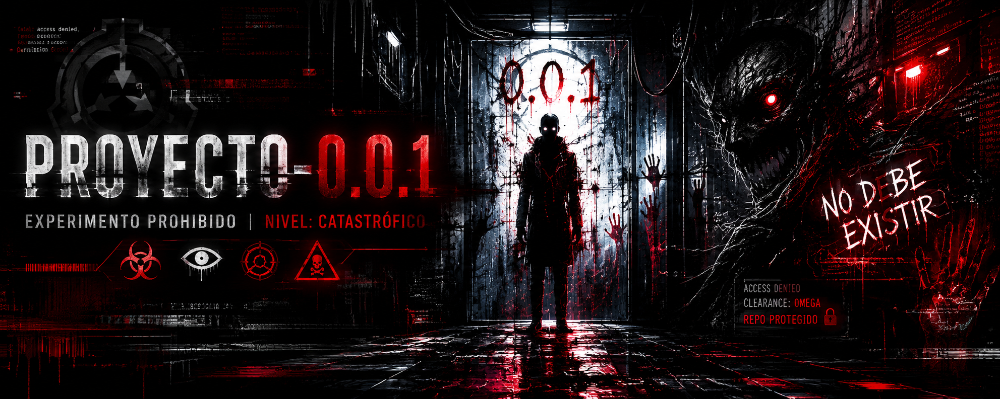

# Proyecto-0.0.1


| Tecnología | Nivel |
|------------|--------|
| HTML | ⭐⭐⭐⭐⭐ |
| CSS | ⭐⭐⭐⭐ |
| JS | ⭐⭐⭐ |
## esto muestra las barras 

HTML      ██████████ 100%
CSS       ████████░░ 80%
JavaScript ██████░░░░ 60%

## esto muestra el tip

> [!TIP]
> Consejo útil

## peligroso 

> [!WARNING]
> Cuidado con esto

## tegnologia


```
no se que es

```

## código 


```js
const nombre = "Zusita";
```
